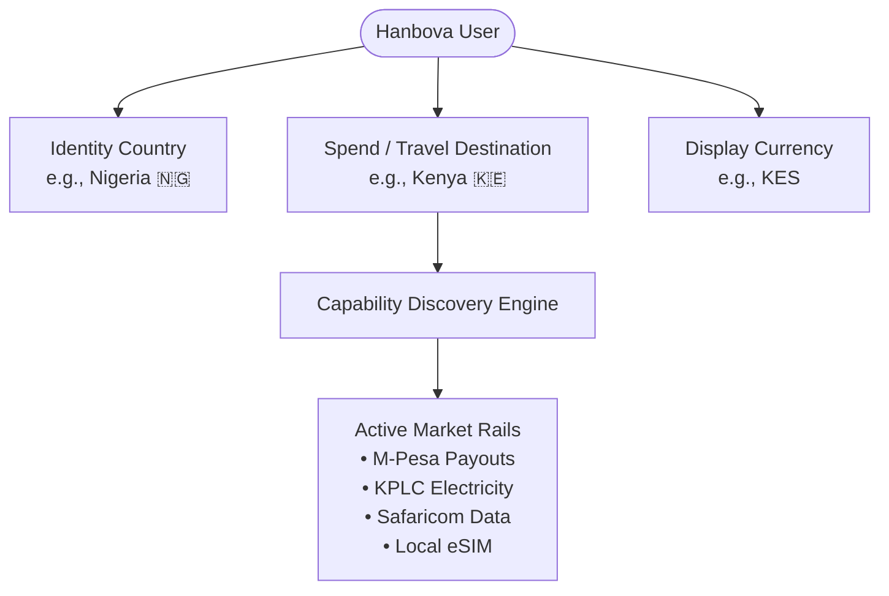
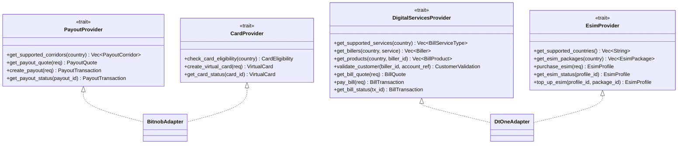

# Hanbova Spend & Travel Architecture

**Milestone**: M3B.1  
**Status**: Implemented (Sandbox Foundation)  
**Security Level**: High (Zero frontend secret exposure, strict provider isolation)

---

## 1. Executive Summary

Hanbova extends from a pure self-custodial ecash wallet into a **Bitcoin-first everyday spending and pan-African travel wallet**. This architecture decouples the mobile client from any specific financial vendor by establishing:

1. **A Tri-Part Country Context**: Separating user identity/compliance from destination spending markets and UI display currencies.
2. **Normalized Backend Provider Abstractions**: Providing standard Rust async traits for Payouts, Virtual Cards, Digital Utilities, and eSIMs.
3. **Provider Implementation Routing**:
   - **Bitnob**: Powers domestic cash-out corridors (M-Pesa, Mobile Money, Local Bank Transfers) and virtual USD Visa/Mastercard cards.
   - **DT One**: Powers digital utility bill payments (Airtime, Data Bundles, Electricity Tokens, Water, Pay TV, Internet) and instant eSIM cellular provisioning.
   - **Future Providers (e.g., Reloadly)**: Can be plugged in on the backend without requiring mobile app updates.
4. **Zero Provider Secret Leakage**: All API keys, secrets, signing certificates, and partner endpoints remain strictly on the backend. The Flutter app interacts exclusively with normalized Hanbova API endpoints.

---

## 2. Tri-Part Country Context Model

Traditional apps couple residency, currency, and available features into a single immutable field. Hanbova separates this into three distinct, decoupled dimensions:



### Context Dimensions:
- **`identityCountry`**: The user's registration origin or KYC jurisdiction (e.g., `NG` - Nigeria). This is preserved across international trips.
- **`spendCountry`**: The market where the user is currently transacting or traveling (e.g., `KE` - Kenya). Changing the spend country dynamically alters available billers, payout rails, and eSIM packages.
- **`displayCurrency`**: The fiat currency used to render localized amounts and exchange rate estimates (e.g., `KES`, `NGN`, `GHS`, `USD`). Defaults to the spend country's native currency, but can be customized.

---

## 3. Provider Abstraction Layer

All external partner integrations implement normalized async traits defined in `services/api/src/providers/mod.rs`:



### Initial Vendor Responsibilities:

| Service Domain | Primary Provider | Supported Corridors / Capabilities |
| :--- | :--- | :--- |
| **Local Payouts** | **Bitnob** | Kenya (M-Pesa, Bank), Nigeria (NIP Bank), Ghana (MTN/Vodafone MoMo), Uganda (MTN/Airtel), Rwanda (MoMo), South Africa (EFT) |
| **Virtual Cards** | **Bitnob** | Instant USD Visa / Mastercard funded via Bitcoin sats |
| **Everyday Bills** | **DT One** | Airtime, Mobile Data Bundles, Prepaid Electricity (Tokens), Water, Pay TV, Fixed Fiber Internet |
| **Travel eSIM** | **DT One** | Local Africa 4G/5G plans, Africa Regional bundles, Global coverage, SM-DP+ provisioning |

---

## 4. Market Capability Discovery

The mobile app queries `GET /api/v1/markets/{country}/capabilities` to retrieve the active capability matrix for the destination:

```json
{
  "country": "KE",
  "name": "Kenya",
  "currency": "KES",
  "flag_emoji": "🇰🇪",
  "capabilities": {
    "payouts": true,
    "mobile_money": true,
    "cards": true,
    "airtime": true,
    "data": true,
    "electricity": true,
    "water": true,
    "tv": true,
    "internet": true,
    "esim": true
  }
}
```

The Flutter UI uses this capability matrix to dynamically display or hide utility categories and travel corridors without hardcoded client-side rules.

---

## 5. Security & Secret Protection

1. **Backend Environment Isolation**:
   - Provider credentials (`BITNOB_API_KEY`, `DTONE_API_KEY`, `DTONE_API_SECRET`) are loaded exclusively into backend memory from environment variables or secure key vaults.
   - In development and CI environments, provider adapters automatically fall back to deterministic sandbox simulation when credentials are not supplied.
2. **Zero Mobile Exposure**:
   - No partner endpoints, bearer tokens, or HMAC secrets exist in the Flutter codebase or compiled binaries.
3. **Idempotency & Quote Expiration**:
   - All quotes (`BillQuote`, `PayoutQuote`) carry explicit 15-minute expiration timestamps to protect users from FX volatility.

---

## 6. Verification and Testing Matrix

- **Backend Unit & Integration Tests**: `services/api/tests/market_and_providers_test.rs` and `services/api/src/providers/mod.rs` tests verify corridor limits, exchange rate computations, account validations, electricity token generation, and eSIM profile provisioning.
- **Flutter Domain & State Tests**: `test/market_test.dart`, `test/spend_bills_test.dart`, and `test/travel_esim_test.dart` verify context independence, UI formatting, data remaining fractions, and JSON mapping.
