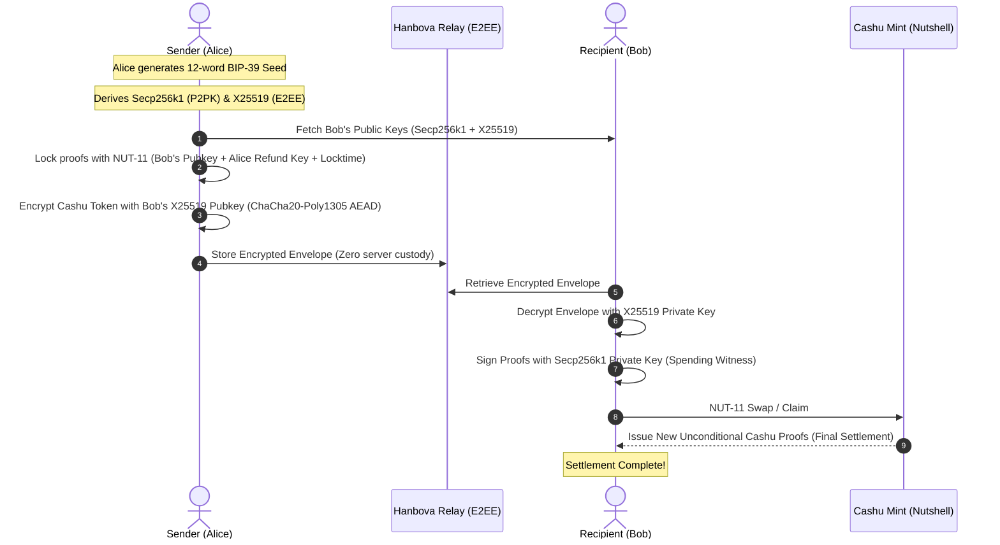

# Hanbova: Afro Bitcoin Fellowship Presentation & Pitch Guide

> **Tagline**: *Send protected.*  
> **Mission**: Making everyday Bitcoin payments safer and consumer-ready across Africa.

---

## 1. The Problem: Irreversibility & Fraud in Everyday Commerce

Across Africa, e-commerce and peer-to-peer trade face massive trust barriers:
- **Buyer Risk**: When buyers pay upfront via Lightning or on-chain Bitcoin, funds settle instantly and irreversibly. If goods are not delivered or counterfeit, buyers have no recourse.
- **Seller Risk**: When sellers send goods before receiving final payment, buyers may default or refuse payment.
- **The Gap**: Bitcoin is the most resilient money, but lacking conditional payment protection forces ordinary African merchants and consumers back onto centralized, permissioned fiat rails.

---

## 2. The Solution: Hanbova Protected Send

Hanbova provides **two intuitive payment rails in one unified wallet**:

1. **Instant Send**:
   - Standard sub-second Bitcoin Lightning payment (BOLT11).
   - Final immediately.
   - Ideal for in-person coffee, mobile top-ups, and trusted transfers.

2. **Protected Send**:
   - Conditional ecash escrows using Cashu **NUT-10 (Spending Conditions)** and **NUT-11 (P2PK Pay-to-Public-Key)**.
   - Funds are locked cryptographically to the recipient's public key.
   - The sender specifies a **claim window (locktime)**.
   - If the recipient claims the payment within the window, the mint verifies their cryptographic signature and settles the tokens.
   - If the recipient fails to claim or defaults, the sender can execute an **on-chain refund** after the locktime expires.

---

## 3. Core Architecture & Cryptography

---

## 4. Live 3-Minute Demonstration Script

### Part 1: Instant Send & Receive (Lightning)
1. Alice opens Hanbova, selects **Receive**, enters `5,000 sats`, and generates a BOLT11 invoice.
2. Bob taps **Send**, enters Alice's invoice, and swipes to pay.
3. Sub-second settlement is displayed with sound & haptic feedback.

### Part 2: Protected Escrow (Cashu NUT-11)
1. Alice buys electronics from Bob across town for `20,000 sats`.
2. Alice taps **Send -> Protected Send**, enters `@bob`, sets a `24-Hour Delivery Window`, and confirms.
3. Hanbova locks the ecash proofs with Bob's P2PK public key and encrypts the transport envelope with X25519.
4. Bob receives an instant push notification on his device, inspects the escrow, and delivers the package.
5. Upon package delivery, Bob taps **Claim Payment** — his wallet signs the spending witness and deposits fresh unspent ecash proofs into his balance.

### Part 3: Seed Backup & Multi-Mint Resiliency
1. Alice navigates to **Me -> Security -> Recovery Phrase Backup**.
2. Displays the 12-word BIP-39 seed with tap-to-reveal.
3. Demonstrates the 3-word verification quiz and multi-mint live probe validation.

---

## 5. Technology Stack & Open Source Deliverables

- **Mobile Client**: Flutter 3.29, Riverpod, GoRouter, Biometrics, Secure Key Storage.
- **Backend & Escrow**: Rust 1.84, Axum, Cashu Dev Kit (`0.18.0-rc.0`), SQLx, PostgreSQL.
- **Protocols**: Cashu NUT-00 through NUT-11, Hanbova Protected Protocol (HPP-01 & HPP-02).
- **Test Coverage**: 55 automated unit & integration tests passing (100% green).
